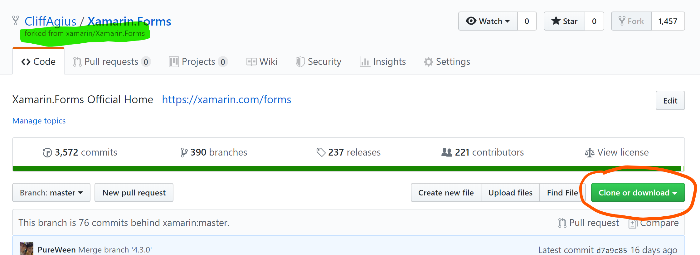
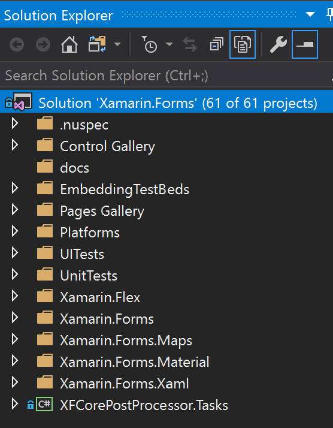

# 10 steps to submitting your first Xamarin.Forms PR.

As a Freelance Xamarin Dev I spend time now and then looking at the [Xamarin Github](https://github.com/xamarin/Xamarin.Forms?WT.mc_id=OSS-MVP-5003764) to see if the issue I have been battling with is my code or some bug in Xamarin.Forms or maybe I am trying to work out why something isn't working how I had hoped.

Now I am not saying by any stretch that Xamarin is a buggy code base far from it in the past year or two it has become very stable compared to previous years and yes there are bits here and there (Looking at you UWP!!) that need input but find me a code base that is 100% bug free.

I have also spent time learning the way that Xamarin works by cloning the repo and taking a look around, looking at bugs in the Issues lists and watching people on Twitch fixing things.  But I then stumbled across a bug that I needed fixed for a project and it looked like a simple(ish!) fix so I thought here is my chance to dive in and help out.

This blog is about the process of going from looking at the Github Repo and finding an issue to having a PR accepted and is aimed as a reminder to future me of the process and to help those that have never submitted a PR to an OpenSource project.

## Step 1: Read the Contributing Guidelines

Here you will find details on the Code of Conduct and signing the .NET Foundation CLA so head over to [Contributing](https://github.com/xamarin/Xamarin.Forms/blob/master/.github/CONTRIBUTING.md?WT.mc_id=OSS-MVP-5003764) page and make sure you happy and you want to to dive in otherwise reading the rest of this blog is pretty pointless. ;)

## Step 2: Clone the Repository

First you need to Fork the Xamarin.Forms repository so go to GitHub page and click the Fork button top right.

Now you need to get a local copy to work on so once the Fork process is completed you should be on YOUR github repositories page and you can tell this as your Github name will be top left with the "Forked from xamarin/Xamarin.Forms" below.

So click the big green Clone or Download button to get the URL and head to your favorite Git Client.

###### I Use PoshGit at the Command Line
I like [PoshGit](https://github.com/dahlbyk/posh-git?WT.mc_id=OSS-MVP-5003764) as it allows me to see what is happening at my command line with the git repo I am working with, but you can use what ever tools you like to get the code on your machine so you can follow along.

At the command line use the copied URL like this:

    git clone https://github.com/CliffAgius/Xamarin.Forms.git

And it should look like this when it's done.

## Step 3: Add links to the Remote

Now we have it locally we need to add a link to the remote so that we can push our changes when we have done them.

So change directory

    cd Xamarin.Forms

If we now go back to GitHub and get the URL of the main Xamarin.Forms repository we can add a remote link so that we can pull any future changes into our remote.  The Xamarin repository changes many times a day it's that active so we always want this ability.

Now add this Remote to our local git.

    git remote add upstream https://github.com/xamarin/Xamarin.Forms.git

And to confirm it's worked and we have the required remotes in place use:

    git remote -v

Which should give you something like this:

This shows 
        - Origin which points to our forked version and we have full read/write of this.
        - upstream points to the main Xamarin.Forms repository and we can only pull or read from this.

## Step 4: The fun part

Now you have all you need to fire up VisualStudio and poke around the code. But lets explain all those projects first.

- Controls Gallery - A basic application where you can play with the various controls.  This is also the part where you will add your Issue so that you can show it's been fixed.
- Pages Gallery - Another test application but this time for the Pages.
- Platforms - Where all the platform specific renderers live so when in your code you add a button if it's Droid then it will render (EDIT: Actually on Android you will now get the Fast Renderer for some controls...)

>Xamarin.Forms.Platform.Android/Renderers/ButtonRenderer.cs

- UITests - this one explains itself and also very important if you fix a bug start by writing a test for it the Xamarin.Forms team will love you to go Red->Green->Refactor.
- Xamarin.Forms - These are the Core Xamarin abstract controls and other non-platform specific items.  For example in here the Button.cs would show the bindable objects etc that can be used in your application.
- The other folders speak for themselves so dig around and have a play.

## Step 5: Pick a Bug to fix

Head back to the [Xamarin.Forms Github Issues page](https://github.com/xamarin/Xamarin.Forms/issues?WT.mc_id=OSS-MVP-5003764) and look for an issue to fix.  There are many labels used in the project but a good place to start is with:

Find the one you want to help with and in the issue there should be some notes on the problem and some steps to re-produce the fault. I suggest that you leave a comment to say that you have picked this issue up so that you don't end up with more than one person fixing the same thing.

## Step 6: Time to Branch

So that we can push our changes and have them pulled into the main repository it's required that we create a branch and work in this branch.

    git pull upstream master
    git push origin master

This pulls the latest changes from the Xamarin.Forms project and pushes them to your fork, we do this to make sure we have the latest and greatest changes.

    git checkout -b issue5168

Here you use the issue number from the Git Issue you looked at earlier, so in my case above I am looking to work on #Issue 5168 so I create a local branch for that.

## Step 7: The Magic fix

Now you have worked out where you want to help and created a branch for the fix and it's time to implement the magic.

Within the solution find the following:

Inside the Xamarin.Forms.Controls.Issues.Shared create a new class named after your issue, so to match your branch and in this sample case Issue5168.  The easiest way to honestly do this is to create a copy of an issue like yours and rename it.  However as a template this should work for you:

    using System;
    Xamarin.Forms.CustomAttributes;
    using Xamarin.Forms.Internals;

    #if UITEST
    using Xamarin.Forms.Core.UITests;
    using Xamarin.UITest;
    using NUnit.Framework;
    #endif
        
    namespace Xamarin.Forms.Controls.Issues
    {
    #if UITEST
    	[Category(UITestCategories.ManualReview)]
    #endif
    Preserve(AllMembers = true)]
    [Issue(IssueTracker.Github, 5168, "Incorrect increments stepper with small increments... - Droid", PlatformAffected.Android)]
        	public class Issue5168 : TestContentPage // or TestMasterDetailPage, etc ...
        	{
        		protected override void Init()
        		{
        			Label header = new Label
        			{
        				Text = "Please make use of the stepper below to step up and back to zero to ensure no Exponent value is displayed...",
        				FontSize = Device.GetNamedSize(NamedSize.Large, typeof(Label)),
        				HorizontalOptions = LayoutOptions.Center
        			};
        
        			Stepper stepper = new Stepper
        			{
        				Minimum = 0.0,
        				Maximum = 1.0,
        				Increment = 0.05
        			};
        
        			Label valueLabel = new Label
        			{
        				Text = $"Value - {stepper.Value.ToString()}"
        			};
        
        			Label stepPosLabel = new Label
        			{
        				Text = $"Position - {stepper.StepperPosition.ToString()} * {stepper.Increment.ToString()}"
        			};
        
        			stepper.ValueChanged += (s, e) =>
        			{
        				valueLabel.Text = e.NewValue.ToString();
        			};
        
        			Content = new StackLayout
        			{
        				Padding = new Thickness(20),
        				Children =
        				{
        					header,
        					stepper,
        					valueLabel,
        					stepPosLabel
        				}
        			};
        		}
            }
        	}

The important part here is at the top of the class there are class attributes that give the class an Issue to track and also some text on what the issue is.  The purpose of this class is to build a minimal UI in code to reproduce the error.  From this you then build/edit the UITests to prove the error and fix the code to stop the error.

Once you have this class written select your chosen device and run the Control Gallery target, within this you can select Goto Test Cases and find your reproduction.

Once you have your text case written such that you can prove the issue it's time to work your magic and fix the issue.  For fixing refer the to the project layout detailed above, not forgetting that you should ideally add UITests so that in the future the tests being run can prove the issues have not re-surfaced.

## Step 8: Time to submit the PR

You have weaved some magic and got the bits to dance to your happy tune thus fixing the problem, you have checked this by running the test cases in the gallery and your UITests are all green ticks.  This means you ROCK and deserve a nice coffee with maybe some biscuits or a sticky bun.  But your work here is not finished yet, the rest of the world want that awesome fix so it's time to push your changes and submit that all important first PR.

First you need to push the changes to your forked github repo

    git push -u origin issue5168

This will push the changes to your remote fork of the project, using the -u links the local and remote branches so in the future while your tinkering with your work you can just use

    git push origin

But you nailed it on the first pass (Ok maybe the 2nd!) and you have a fix to share with the world.  Go back to your fork on GitHub in the browser and click the new green button "Compare & Pull request".

This will create the pull request with the main project and give you the option to add some details on what you have done, please complete the template with as much detail as you can as this will help the case of your PR being accepted.  Once you are happy all the parts are in place click the "Create Pull Request"

## Step 9: Your work is done

This means that your work is done congratulations you have submitted your first PR to the Xamarin.Forms project and on behalf of all Xamarin users thanks for fixing that bug/issue.

All that is left is to wait for your PR to be accepted and merged but be prepared as this could lead to a conversation in the PR thread with one of the Xamarin team to finesse your PR or if you are just plain awesome it will just get merged at the next release.

## Step 10: Repeat

Your PR was accepted your on a high your sticky bun and biscuits are finished and you now have code being used by developers all over the world on mobile projects varied and wide you feel invincible... Time to take that excitement and energy and pick another to fix so I'll help you the list of open issues can be found here:

[Xamarin.Forms Github Issues page](https://github.com/xamarin/Xamarin.Forms/issues?WT.mc_id=OSS-MVP-5003764)

I hope that this helped you please leave comments below in the chat unless of course your future me in which case your welcome.

## Blog post used in creating this:

[The beginners guide to contributing to a github project - Rob Allen ](https://akrabat.com/the-beginners-guide-to-contributing-to-a-github-project/)

[Beginners guide to contributing to Xamarin.Forms - David Ortinau](https://devblogs.microsoft.com/xamarin/beginners-guide-contributing-xamarin-forms?WT.mc_id=OSS-MVP-5003764)
