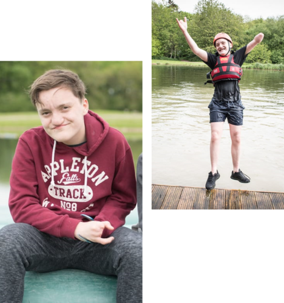
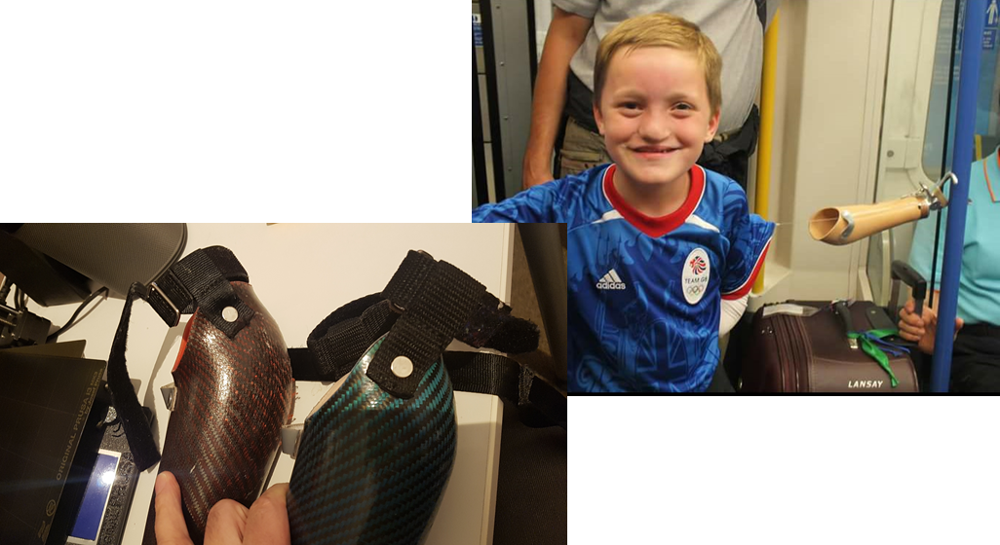
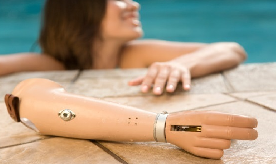

# Handy and the Big Picture

Meet Kayden a Local 15 year old and the son of close friends, as you can see he is a happy teenager (They do exist!) full of fun and ready to take on the world...

You may also notice that Kayden was born without a left forearm and hand and is also missing the middle fingers on his right hand, so life is a challenge at times but it's Ok the NHS (National Health Service here in the UK) are there to help free of charge (if you conveniently forget you pay TAX).  So from a very young age Kayden and his parents have been visiting hospital to be measured and fitted with a prosthetic left arm, great you may think job done whats next.

Sadly these arms are exceedingly basic consisting of some heavy plastic with a heavy metal hook on the end, this attaches to Kayden with Velcro and is actuated with a wire going up his sleeve to his other shoulder.  Now this is better than nothing at all and is far more than available in many parts of the world but the UK is not a poor nation we should be able to do better.  The official line from the NHS is that will not issue a growing child a full BioMechanical prosthetic until they are an adult as they are very expensive and will outgrow it too quickly, by expensive they cost over £45,000 for a basic unit that can only move a few fingers and isn't much different from the hook anyway.

---

Why am I blogging about this, well in 2016 there was some press coverage of a dad that 3D printed a hand for his daughter, that afternoon in the playground Kayden's mum and I was chatting and she asked if I had seen it and if still I had a 3D printer.  I answered yes to both questions and her reply was a sheepish smile before asking if I could help, of course I can was my reply... Oh what a journey since then... (Note to self must learn to say No...)

This is the first in a series of blogs over the coming weeks about this 3 year journey, along the way giving talks at Meet-ups and Conferences around the world about the project and my progress. I have been writing blogs along the way but I was never happy with them as I didn't feel the story was interesting and the talks were about the technology used and not really the journey, but recently at the MK.Net meetup in Milton Keynes I was told otherwise and prompted to release the blogs.  However reading over the unreleased material I am still 100% happy so I am starting again and here is the first in many posts.

I will cover everything from the past 3 years the up's and down's as well as the technology I have tried and used in providing Kayden with a Prosthetic Biomechanical Arm that is not only lighter and more comfortable than the offering from the NHS but also far cheaper.

Let's remember that the NHS won't offer Kayden or any other children a full arm until they are adults, but as with all humans we learn to adapt to what we have, so here is Kayden making a cup of tea using his current arm.  In this you can see that he has adapted to his hook but it's still very basic.


    <video src="MakingACuppa.mp4" controls> </video>


The blog title is the "Big Picture" as it occurred to me very early on that there is very little provision in the UK for children's prosthetics as they tend to grow too quick. If the NHS here can't or won't provide mainly due to costs then what are other parts of the world like?  My day job when not writing code as a freelance .NET/Xamarin developer is to Fly a Boeing 787 around the world, in fact I am currently writing this from the crew rest area on a flight back to the UK.

On my many travels I go to many countries that have even less provisions than the UK so I have made it a mission of this project to not only provide Kayden with a working arm but to do so with easily available parts at the cheapest price.  My ultimate dream once Kayden and his family are happy is to provide all the designs and a Bill Of Materials so that it can be repeated by anyone around the world, maybe even get funding to send kits.

So if this is indeed interesting then follow along as I talk about 3D printing, IOT Electronics and a Xamarin Mobile app, I post often about the project on Twitter if you want the latest and greatest news follow me there @CliffordAgius

Finally I want to thank Kayden and his parents for allowing me to give talks and finally blog about this journey and for providing the photo's I am using.

Right my break is nearly over it's time to go grab a coffee and head back to the flight deck.

Oh and here is where I have managed to get to in this project...


    <video src="HandyMoving.mp4" controls> </video>


## Next: Finding and 3D Printing a Hand.