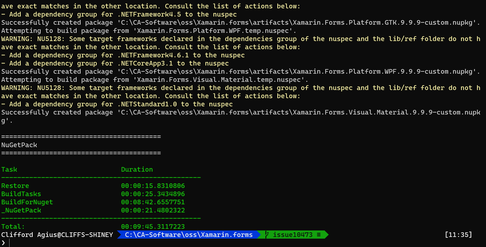
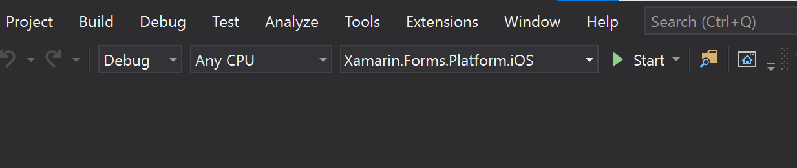
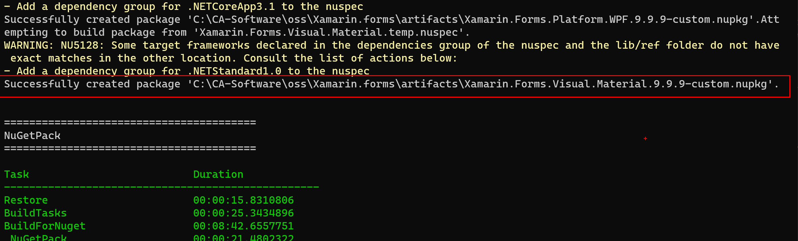
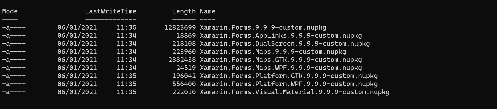
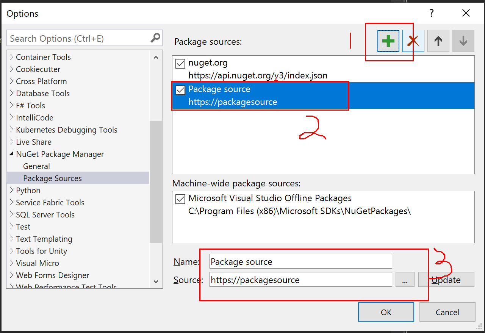
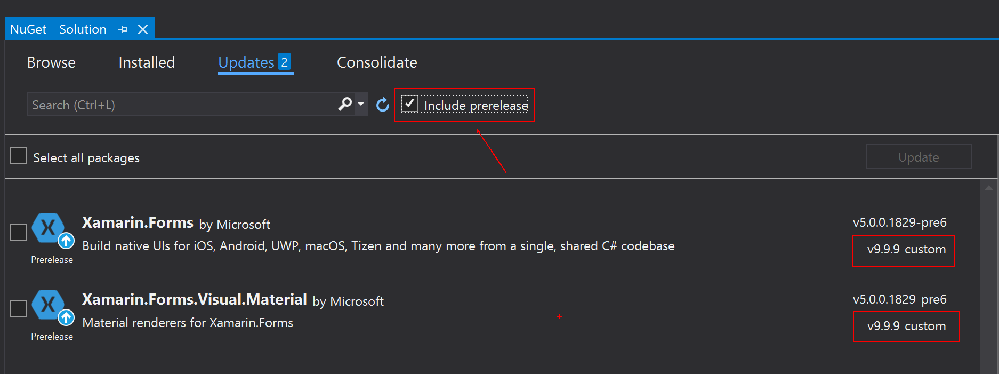
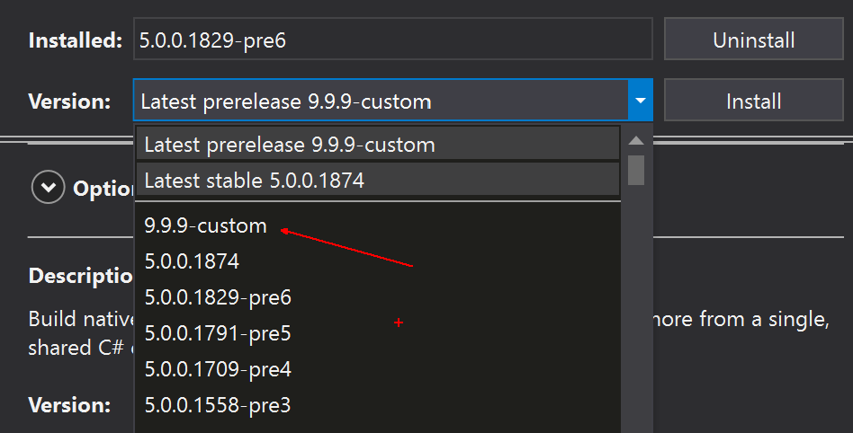

# Create your own Xamarin.Forms NuGet

I am guessing that if you are here you have found a bug with Xamarin.Forms (Or A.N.Other OSS Project!) and you followed my previous blog [Here](https://www.cliffordagius.co.uk/post/firstxamarinpr/) to create your awesome fix and PR which you are awaiting review.

I had exactly this over the last week (Jan 2021) with a Memory Leak in the CollectionView control on UWP in a Xamarin.Forms project.  The issue had been open for a while and you can see it [here](https://github.com/xamarin/Xamarin.Forms/issues/10473) and there were various other issues related to the same problem, the good news is that the fault was found by @Gentledepp and they even created a fix AWESOME!! however they have an internal build of Xamarin, so the fix was pulled into that Fork but no PR was created back to the main Xamarin.Forms Repo BOOO...

So, my first task was to create a PR for this fix, and I thank @Gentledepp for the great work on creating the fix in the first place, but if you do create a fix for an Open-Source Project then please create a PR to give that fix back to the community.

## You created a Fix now what?

So, your fix is created, and it is awaiting review or like mine was merged really quick (I Poked the team on Twitter! 😜) but now it's sitting there awaiting the next release with your fix to be published.  In this time your project could be stalled, and your client is getting upset that it's outside your control, maybe they even start to complain about things.  Well, we can create our very own NuGet and use this in our project until the release from the team and carry on working.

We do this very simply from the command line, first make sure you’re in the Xamarin.Forms folder and in the Branch that contains your fix then run the following command.  

    ./build.ps1 -Target NugetPack -ScriptArgs '-packageVersion="9.9.9-custom"'

But before you run the command you will notice that there is `-packageVersion="9.9.9-custom"` this is a way to name your package with a version number and name so that it doesn't clash with the official builds, you can of course remove this if you don't want to do this.

    ./build.ps1 -Target NugetPack

This takes approx 10 minutes to run on my machine which is no slouch so go grab a Cuppa/Coffee or plan it into your day so you can walk the dogs or go for that run you promised yourself...

When it's complete hopefully you will see a result like so:

## Whats all the WARNINGS!

You may also note that there are some WARNINGS but those in yellow are more INFO than actual warnings and you will see lots of them, if however, you see RED WARNINGS these will cause the build to fail.

If this happens it (for me at least!) seemed to be that the project had last been saved with Debug and Control Gallery as the current build target.  **So make sure it's set to one of the projects in the Platforms folder and Any CPU is selected.**

## Where is our NuGet?

The NuGet that is created will be in the Artifacts folder that you can find in the root of the solution and just to help you find it, at the end of the Build it tells you where it was saved and what it was called.

Looking in the folder you will see all the Nugets created.

## How to use this NuGet?

Now we have created our NuGet and have it with our fancy awesome bug fix we need to be able to use it in out project.  **DO NOT PUSH TO NUGET.ORG GALLERY** this is very important as your NuGet Build could clash with the official version or could be found by another Dev and they use your one by mistake so PLEASE DO NOT PUSH TO NUGET... Use this method instead, it's quick and super easy.

The first thing we need to do is create a folder somewhere that we can store our Nugets as we create them and then reference within Visual Studio.  For me I have created a Folder called `Custom NuGet` but you can call it what you want it's just a folder so be inventive as Naming is hard.

Now you have your folder copy the NUGETS from the `Artifacts` folder into this new Nugets folder, we do this so that as you switch branches in the Xamarin.Forms project as you want to work on another bugfix the Artifacts folder isn't lost.

## Reference the NuGet in your project.

Now you can open the project that you want to take advantage of your new fix and then right click the solution and select `Manage NuGet Packages for Solution` so that you open the package manager.

Once this is open we need to add our Private internal custom NuGet feed so top right click the Gear icon.

Inside the Dialog click the `Add` button (Marked 1) and this will add a new feed location as you can see (Item 2) that is called `Package Source` by default.  At the bottom (Item 3) we use to change the details of this feed to something more meaningful to your team say `Custom NuGet` and then change the location to the Folder you created earlier. Clicking Ok will refresh the Nugets displayed to show the new Custom Nugets.

It's important that on the Updates Tab you have `Include Prerelease` selected and you will then see the Nugets you have created.

You can see that as we called our version `v9.9.9-custom` is shows as the latest version so clicking through to this update, we can select our version from the list and update the projects as needed.

## Final Thoughts.

Well that it you now have your very own NuGet with your Awesome fix and away you go, the only downside to calling our version v9.9.9 is that when the team release the next version it will be hidden as your version number is higher, but if you untick the `Include Prerelease` it will go back to showing the latest stable version.

I cannot say this enough please don't push to NUGET and also make sure your Awesome fix is submitted as a PR so that the rest of us can benefit from your awesome work, and thanks for helping Fix the bugs and keep up the great work.

Happy Coding...

Cliff.

