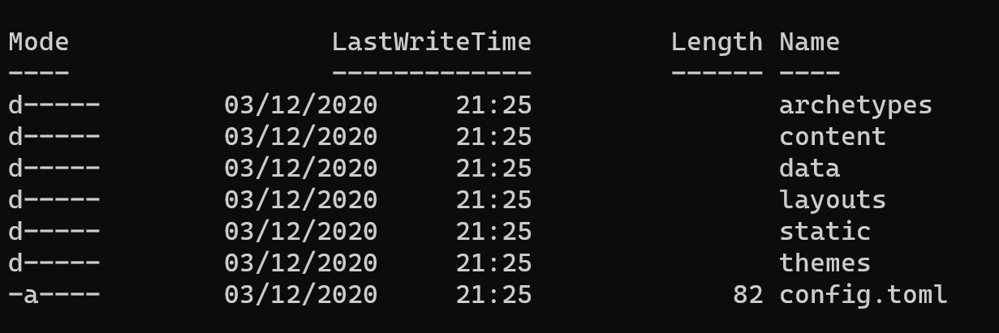
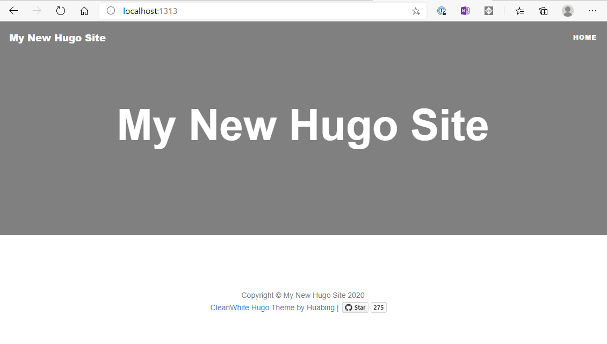
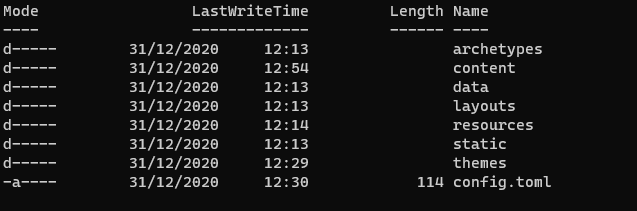
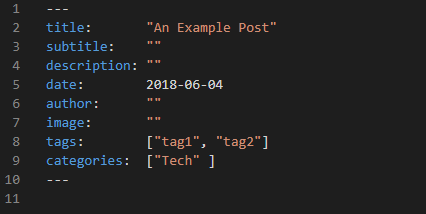
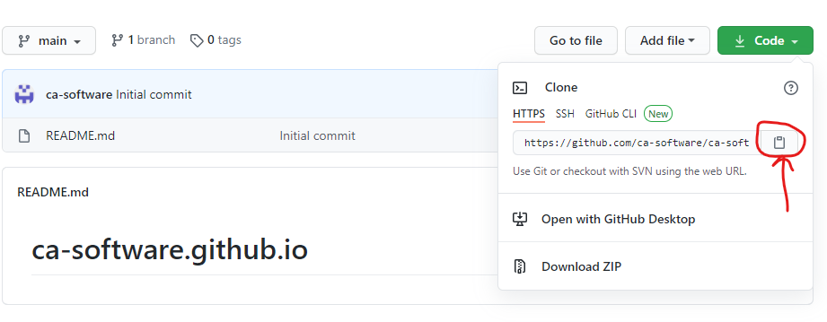
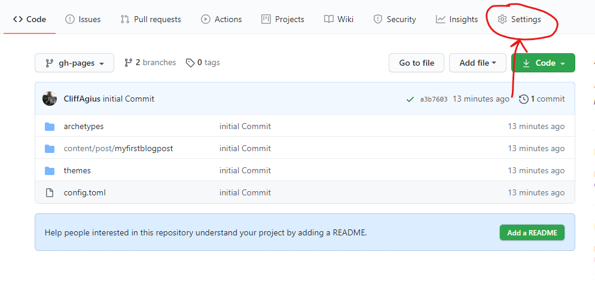
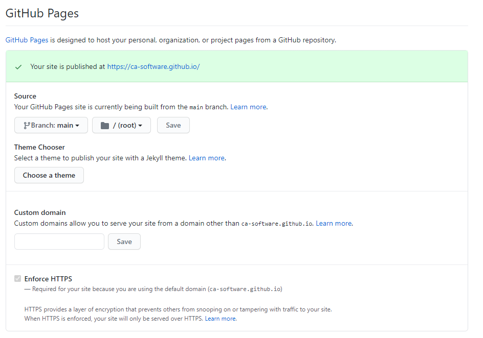
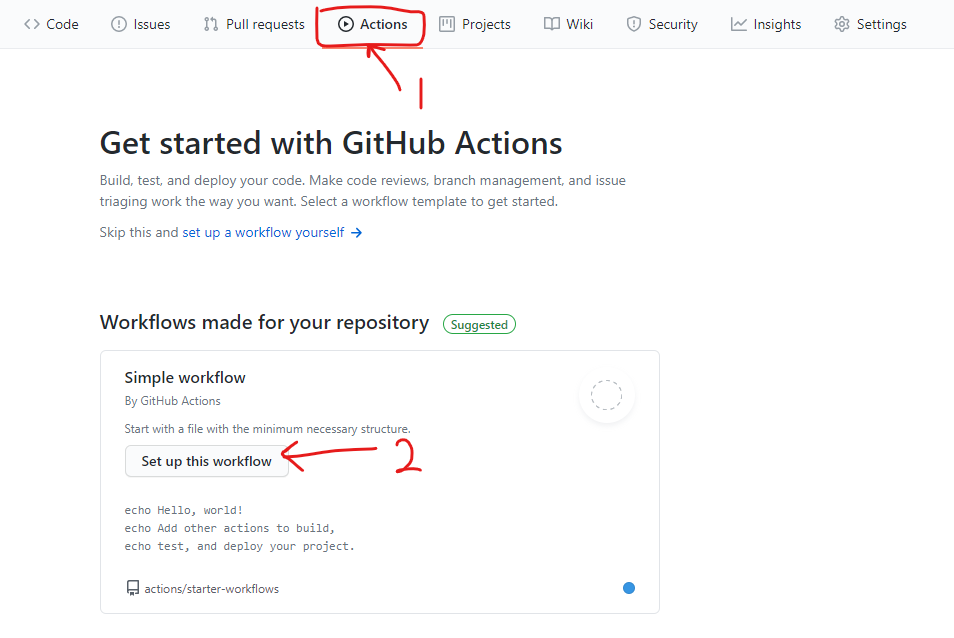
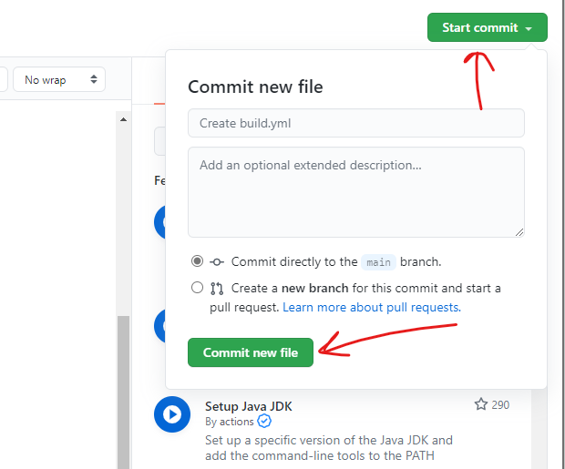
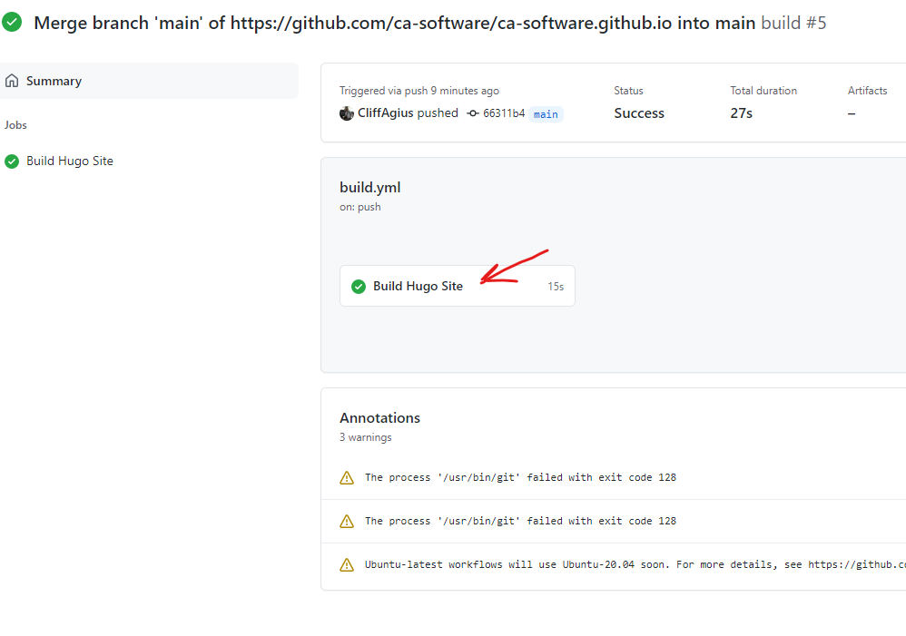

# What and Why?

So, I have hosted my blog using Ghost on Azure Websites for over a year now and in that time I have found it hard to write blogs as much as I would like.  The reason being that I tend to have a lot of time either in the air or downroute somewhere with no data connection, plus I found the Ghost offering for writing Offline not that easy.

Yes, I could write the post but then needed to tweak and play with uploading it using the Admin page of Ghost that took a good 10-15 minutes each time.  Now I confess I may have been doing it wrong but the other reason for the move is the fact that GitHub Pages is well FREE!!! Yes, totally free so here is how to set-up and use Hugo on Github Pages.

## Where did I start?

I started as we all do Bingoogling and looking around, the [Hugo Docs](https://gohugo.io/) are very good and explain how to set-up Hugo locally but not how to host on Github (Not at the time of writing anyway!) plus I didn't feel there was an End-to-End process of how to do this but fear not here is one (I Hope!)

## Installing Hugo

First, we need to install Hugo locally and set-up ready for your awesome blogging website. Now I am a Windows user and I have the awesome [Chocolatey](https://chocolatey.org/) installed so I just used:

    choco install hugo -confirm

If you don't have Chocolatey installed, you can just use:

    Set-ExecutionPolicy Bypass -Scope Process -Force; [System.Net.ServicePointManager]::SecurityProtocol = [System.Net.ServicePointManager]::SecurityProtocol -bor 3072; iex ((New-Object System.Net.WebClient).DownloadString('https://chocolatey.org/install.ps1'))

But as I know you may not be using the same setup as me head to the [Hugo Docs](https://gohugo.io/getting-started/installing) and find your set-up.

Now we have it installed let just be sure it works, so from your favorite command line enter:

    hugo version

You should see something like this:

## Create your Blog Site

Now that we have the Hugo tooling installed, we need to create our site and this couldn't be any simpler you just need to run:

    hugo new site MyFancyBlog

This will create a new Blog site in a folder named `MyFancyBlog` so choose wisely!

Now if we `cd` into that folder we should see something like this:

And that is your new blog site as simple as that, however if you were to publish this it would be a blank blog site so not very exciting, so lets add a theme to make it look pretty.

## Adding a Theme

Now you can roll your one theme and the Docs are very good but if you’re like me and A - don't have the time or B - Crap at design and will make a mes of it then maybe grabbing a pre-baked theme is the best option. This is the first point I diverge from the Hugo Docs, in the docs it suggests that you add a Theme as a `git` submodule, which is fine as long as that theme is exactly what you want as you can not change unless the theme designer pulls in your PR.  However, if you want to use a theme as a starting point and edit from there you may want to do what I did and fork the Theme into your project, obviously check the Licence the Theme designer used before doing this.

So go pick a theme from [https://themes.gohugo.io/](https://themes.gohugo.io/) there are 1000's so take your time I'll wait here for you...

Right so you picked the theme lets add it, so go into the folder you created earlier, and we need to make it a `git` repository so that we can track the changes and push to GitHub later.

    git init
    cd themes
    git clone https://github.com/zhaohuabing/hugo-theme-cleanwhite  <-- The Theme I picked and used...
    git add .
    git commit -m "Initial Commit"

This will clone the `hugo-theme-cleanwhite` theme into the themes folder so that you can edit and change as you see fit, you will notice that I ahve changed some of the layout and colours as well as adding a few parts here and there. It's all HTML and CSS changes mostly with a few minor edits to the GO that s part of the page it's actually a really nice way to decorate HTML so was a fun process.  

However, once we have made our changes we need to tell Hugo to use this theme when it does it's builds, so using your favorite text editor which should be [VSCode](https://code.visualstudio.com/) in which case from the command line you can use:

    code .

which will open the folder in VSCode ready to edit. So now open the `config.toml` file and add:

    theme = "hugo-theme-cleanwhite"

While you’re in here you can set the Base-URL to your new blog sites URL and obviously change the title etc.  It's pretty obvious what you need to change as there are only 3 lines.

##  Test

Now we have a theme and all the bits set we can test to see what we have, and this is where Hugo is great as you can run the server locally to see exactly what it will look like when it's live.  You don't need anything other than:

    hugo server -D

This will build the files and host them on LocalHost for you, in your terminal you should see something like:

So, open your browser and and copy/paste the Localhost location which in this case is: 'http://localhost:1313/' and you shoudl hopefully see you fancy new Blog site which in my case looks like this:

## Let’s Explore

So we have a working site with a nice theme but how is this all coming together than and what do we need to do/know about the folders and structure to add out informative blog posts...  Well first lets look at the folder structure:

Now I could explain it all here but the [Hugo Docs do a much better job than me](https://gohugo.io/getting-started/directory-structure/) so go take a look there, it's Ok I'll wait here again... So as you see there really isn't anything we need to worry about in the folders other than the Content Folder as this is well our content, what we want to share with the world.

Now if we go into that folder it's empty as we havn't created anything yet so lets start.

## Our First Post

As I like things to be neat and as I am copying over Blog posts from my old Azure/Ghost blogging site I wanted to have a folder for each Blog post rather than having all the markdown files in one big mess of a folder and all the images used in the Images folder elsewhere.  So I have created a folder in the `Content` folder called `post` and then inside here I createmy blog posts with a folder for each post.  In this folder will go teh Markdown file (What your reading now!) and any other required content like Images/MP4 file etc so that it's all in one place. But how do we do that nice and easy without popping out to File Explorer and creating things, well Hugo again does this for you with a simple command...

    hugo new /post/myfirstblogpost/index.md

This will create a folder in your `post` folder and then inside that the starting Markdown document that you can use to start your blof post, the header of this MD file holds some info thats worth taking aquick look at:

As you will see here it's all fairly self explanitory so fill in the blanks, howhever I mentioned that I wanted to posts and images etc all in the same folder so for the `image:  ""` part in here you reference the image you want to be in the header at the top of the page and as an example you reference teh image from the base of the `Content` folder so:

    image: "/post/myfirstblogpost/myfirstblogpostHeaderImage.png"

and then place the image file in the same folder as the MD (Markdown) file for your blog post, HOWEVER a big warning here make sure that the folder name used in the `image` tag is all LOWERCASE otherwise it won't work! If on;y I had a £1 for everytime I have forgotten this...
 
As for the images in the content of the post like I have used on this page these you refernce directly by name of the image like so:

     

Now I know what your thinking Cliff why have you named your image with a date-time tag you idiot... Well as I like most people cut&paste images to save having to open the folder inside the conttent/post etc etc to paste the image in I use a great `VSCode` extention called [Paste Image](https://github.com/mushanshitiancai/vscode-paste-image) so I just use the Windows Snip & Sketch tool to copy the image on the screen and then inside the Markdown File (ON Windows!) I paste it with `CTRL+ALT+V` and it pastes the image into the same folder as the MD file and names it with the current Date/Time as you see above.  Then all you need to do is give it a friendly Alt Text inside the `[]` for those readers using screen readers.

Also in this little block you can add:

    draft: true

this will ensure that the post is visble to you while testing but won't go live util you change it to false, you can even set a Publish date that will mean the post will go live when this dat passess:

    publishDate: "2021-12-31"

## Whats next

So we now have our blog post written it's awesome and we need to get to out there for the world to read... But first lets check it's going to look good:

    hugo server -D

As we used before will run the localhost server, if you didn't stop it earlier and it's still running don't worry Hugo is smart enough to track the changes and re-build as you work away as lok as you save the files as you go. you should now see your first post in the list and can check it's what you expected.

SO... Now we need to share with the world right!

befoew we get carried away though we need to complete a local build of the site so that we have all the Static Files in place ready for the site to be built for us over on GitHub, this is a super difficult step....

    hugo -D

Yeah it's that easy and takes a few seconds then inside the root of our folder you will notice a new folder called `public` this is the base of our site and where all the `GO¬ files live ready to be built by GitHub Actions so lets go set that up.

##  Set-up GitHub Pages

First lets get set-up over at GitHub, so head to www.github.com and login (Or create an account if you don't have one Obvs!).

Now your logged in you need to create a new Repository but this needs be be named in a special way as per the [Docs here!](https://pages.github.com/) which is:

    <YOUR GITHUB USERNAME>.github.io

Once this is done and your in the repo lets link our local to this new repo first we need to get the URL for the repo so if your not a GitHub user under the green 'Code' button click the copy button.

Now in your Command Line tool:

    git add .
    git commit -m "Added our first blog post and pushing to GitHub..."
    git remote add origin https://github.com/ca-software/ca-software.github.io.git  <-- Obviously use your copied URL here...
    git push -u origin main

If you head out to GitHub and into the Repo you will see the files pushed and you may notice that there are less folders this is because empty folders are not pushed to GitHub so the `Static` folder for example will not get pushed as it's empty.

So we have our fancy new blogsite built it runs locally and we have created and pushed a repository to Github but now how do we add some CI/CD magic so that when we push a change it's built by GitHub and hosted with the new changes.  Here we need to use a GitHub Workflow...

First lets create a new branch and I liked to call it `gh-pages` and this should be a copy of the `main` branch

    git checkout -b gh-pages
    git push -u origin gh-pages

now head out to Github again and on your repository click the Settings gear icon:

On the left make sure your on the `Options` tab and then scroll down until you find the `GitHub Pages` section:

In here change the `Source` to the `gh-pages` branch you created earlier and SAVE! (Don't forget to click the SAVE button... You Clicked it right!!!). I here you can come back later and add a custom domain following the docs.

We now have the URL for your new fancy Blog as `<YOUR GITHUB USERNAME>.github.io` so if you head there in your browser you will get a 404 as there is nothing built for the server to server and display.  For this we need a Workflow as Mentioned.

## Adding a Workflow (CI/CD)

Back over on the GitHub page click the `Actions` tab at the top and then in here is lots of example starter actions we can use but lets just pick the top one `Simple Workflow`

Change the name to `Build.yml` at the top and then paste in the following:

    name: build
    on:
    push:
        branches: [main]

    jobs:
    build:
        name: Build Hugo Site
        runs-on: ubuntu-latest
        steps:
        - name: Install Hugo
            env:
            HUGO_VERSION: 0.75.1
            run: |
            mkdir ~/hugo
            cd ~/hugo
            curl -L "https://github.com/gohugoio/hugo/releases/download/v${HUGO_VERSION}/hugo_${HUGO_VERSION}_Linux-64bit.tar.gz" --output hugo.tar.gz
            tar -xvzf hugo.tar.gz
            sudo mv hugo /usr/local/bin

        - name: Checkout main branch
            uses: actions/checkout@v2
            with:
            ref: main
            path: main
            submodules: false

        - name: Checkout gh-pages branch
            uses: actions/checkout@v2
            with:
            ref: gh-pages
            path: gh-pages

        - name: Hugo Build
            run: cd main && hugo

        - name: Copy files
            run: cp -rf main/public/* gh-pages/

        - name: Commit changes
            run: |
            cd gh-pages

            git config --local user.email "actions@github.com"
            git config --local user.name "GitHub Action"

            git add -A .

            if git diff-index --quiet HEAD --; then
                echo "No changes..."
            else
                git commit -m "[CI] build hugo static site"
                git push
            fi    

What is happening here then?  Well what we have set-up is a workflow that `On Push` of the Main branch it gets triggered and then installs Hugo version we specify, checks out thge main branch and carries out a build before commiting it back to the `gh-pages` branch which we set-up as the source for our site earlier. So now it's in place we need to commit this change so that it's taken into effect.

Now this is in place every push to `Main` will trigger this workflow and cause the site to be built and published.

## Lets go live

If you remember we set out first blog post to `Draft` well let make it live by changing this to false and pushing it to the Github so that it can build the site and host it for us.

First we need to switch to the main branch to make the changes as we should never need to make any changes on our local system to the `gh-pages` branch now that is all handled for us by the GitHub Workflow.

    git checkout main
    code .    <- Opens VSCode if installed so we can make the change.

Make the change from `true` to `false`

    git add .
    git commit -m "Making our first blog post live..."
    git pull                                                <-We need to pull back the build workflow locally before we can push...
    git push

## Watch the Magic!

If you quickly head to Github again and the `Actions` Tab you will see the Commit you just made and if you click the title of the Commit you are taken into the Commit and can then see the Build:

And if your quick enough and click the `Build Hugo Site` you can then watch the build process in action but more importantly if any of the steps fail you can see the warnings and why which could help you resolve the issue.  BUT I hope that it all worked a treat, and your Build has that satisfying green tick of success and if it does head over to your new blog site at:

    <YOUR GITHUB USERNAME>.github.io

And bask in the glory of having set-up your blog site.

##  Now what?

We head back to the Command line and use:

    hugo new /post/myAwesomeblogpost/index.md

To write that 2nd post, after all your addoring fans want to hear from you and when your done all you need to do is commit this change to `main` and push and it will get built for you and made live on your Blog Site so you will need:

    git add .
    git commit -m "My helpful commit message"
    git push

And yes I know we shouldn't really push direct to `main` but this is a personal blog so deal with it. 😜

Happy coding

Cliff.

