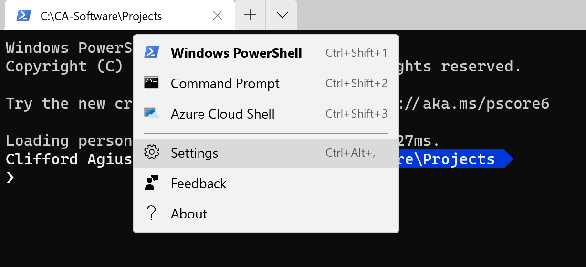
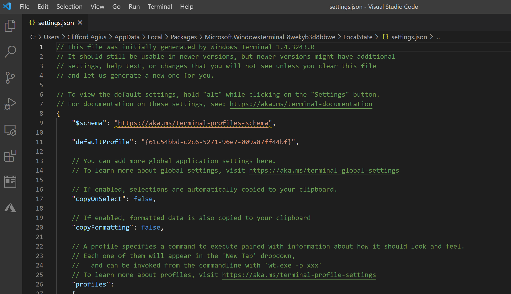
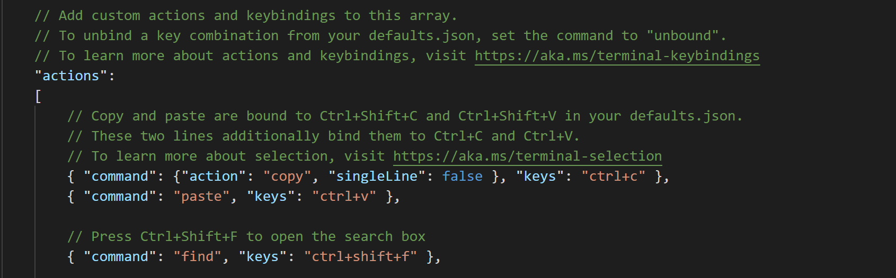
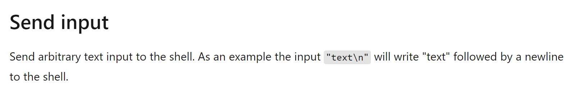
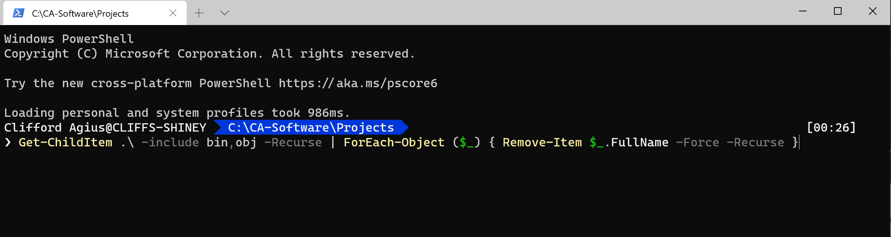

# What and Why?

I do a lot of Xamarin development for clients and when I am working away the builds sometimes fail on say Android or iOS and the reason a lot of the time is where the build system in Visual Studio has had a hiccup and the quickest and easiest way to resolve this is the Delete the Bin/OBJ folders and rebuild.  Sadly, just a Clean in Visual Studio doesn't delete the folders and files so doesn't work especially for Android so it’s a hard delete.

The problem is made worse by the fact that there is a Bin/OBJ folder in each of the project heads and for Xamarin this will be the Core, Android, iOS and for my projects UWP as well so that is 4 projects that you have to go into and delete the two folders.

# How do we manually delete?

There is obviously an easy way of opening the File Explorer and finding the folders and clicking delete, this is time intensive and open to errors of deleting the wrong folder and really messing things up... Ask me how I know...

The other way is to go into Windows Terminal (My favourite terminal program) which is awesome and amazing, and you should be using it, you can read more about it [here](https://devblogs.microsoft.com/commandline/introducing-windows-terminal/?WT.mc_id=DOP-MVP-5003764) or download for free from the Windows Store.

Once I have it open, I run a PowerShell script (More in a bit) to delete the folders and I cut and paste this into Terminal and then next time up arrow and enter as you do it often.

## PowerShell Command

There are 2 versions of the command that Xamarin developers use and they both have advantages and disadvantages.

The first is:

### Git Clean

    git clean -xdf

This cleans all the untracked GitHub files and folders, but to break it down you can see the [docs](https://git-scm.com/docs/git-clean) but quickly.

    x = Delete all untracked Files
    d = Delete all untracked Folders
    f = Force the deletion

#### Pro
This a very powerful command and super short and easy to remember so no need to Post.
#### Con
It deletes every untracked file, so if like me you have a folder in your project with some temp design files or you have added some images but havn't commited them yet etc they get blown away as well.

Second:

### PowerShell Script

This is a longer command that uses the power of PowerShell to delete just the Bin/Obj folders and files but leaves the rest of the project files and folders in place.  This command I got from the awesome [James Montemagno’ s blog](https://montemagno.com/easily-clean-bin-obj-folders/).

    Get-ChildItem .\ -include bin,obj -Recurse | foreach ($_) { remove-item $_.fullname -Force -Recurse }

#### Pro
This will just delete the Bin/Obj files and folders and nothing else so it's not using the .gitignore or the tracked files to decide what to delete.
#### Con
This command is longer and not something I can remember so I used to cut and paste normally from James blog.

## Automating the PowerShell Command

Now we have a command and my favourite being the PowerShell script I wanted to automate this and make it quick and easy to repeat.  So being a Windows Terminal user I read that you can add your own commands and that is what I did.

So open Terminal and at the top, open the settings by clicking the down arrow and opening settings. 

This will open [VSCode](https://code.visualstudio.com/) if you have it installed (Why Wouldn’t you eh!)

Now you have this open scroll down and you will see where you can edit the profiles by adding other tabs or colours and fonts etc, but near the bottom (At least for me!) is a section in JSON called `Actions` and it here we want to play.

## Adding a Macro

In here we can read the [Docs](https://docs.microsoft.com/en-gb/windows/terminal/customize-settings/actions?WT.mc_id=DOP-MVP-5003764) for Windows Terminal and see that there is a cool ability to add our very own Key Binding.

So, reading the docs we need to add our action to `SendInput` and then the command we want to send and the Key binding to make this happen.

    // Alt + C will run the command to delete all the Bin/OBJ folders in the current project tree.

    {"command": { "action": "sendInput", "input": "Get-ChildItem .\\ -include bin,obj -Recurse | ForEach-Object ($_) { Remove-Item $_.FullName -Force -Recurse }" }, "keys": "alt+c" }

So looking at this in detail we have the `Command` and the action set to `sendInput` with the input set to out PowerShell script that we prefer and then finally I picked `Alt+C` as my binding to call the command and this goes into the Keys section.

Tip here is pick a key binding that isn't used for something already and easy to use and remember.

Click Save and then close/reopen Terminal (I find it doesn’t always work!) and your new binding will be live.

For me click `Alt+C` and the command is placed at the command prompt and I then tap `Enter` to run the command.

Now all the Bin/Obj in that folder and all its subfolders are wiped away.

# Warning

Be careful as it's very easy to run this in a top-level folder and wipe the Bin/Obj folders in all your projects by mistake (Again ask me how I know!).

## Conclusion

I use this multiple times per day, and it saves me many seconds each time so over the course of a week/month I have save vital minutes of my live.  Yes..Yes... I know but it's all about the context switch rather than the saved time, the fact that I now after just a few weeks have the muscle memory I am not distracted from what I am doing.

I hope this helps someone.

Happy Coding!
