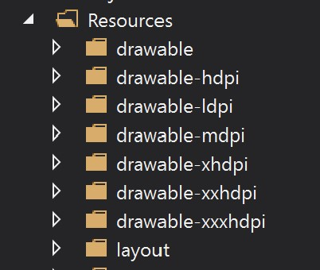
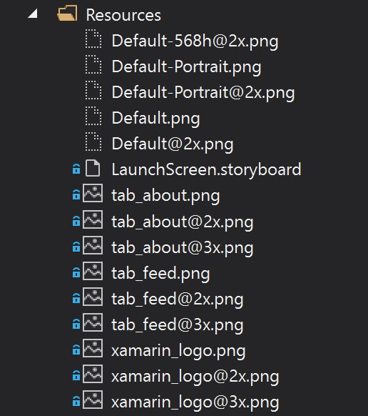
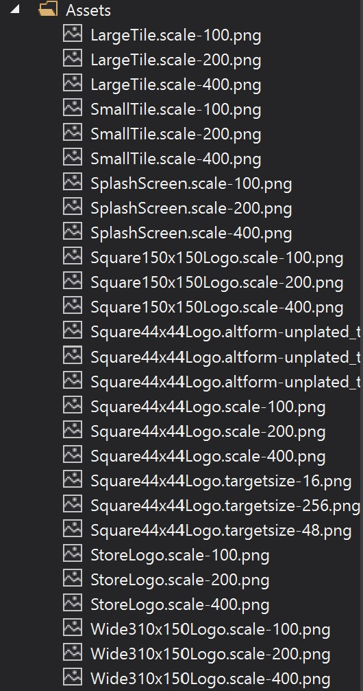
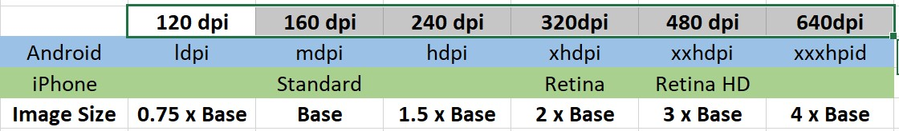

# Working with Images In Xamarin

Your just starting out developing a Xamarin app and wondering how you add an image, where they go and what sizes are needed. This is something I wondered when I first started and it took me a while to resolve it.  The docs [Images in Xamarin.Forms](https://docs.microsoft.com/xamarin/xamarin-forms/user-interface/images?WT.mc_id=DOP-MVP-5003764) are very good (They all are really!) but still I was confused on the best approach.  Well I was asked by someone I have been helping a little get into Xamarin Development so rather than just share with one person I thought a blog would be better.

This blog post then is my attempt at a deep(er)-dive into the art of getting those image resources into the correct sizes and into the correct folders in your Xamarin solution.  I have written this from the perspective of using XAML for the UI layer.

## Where do the Images go?

You have two options here the first is to place them in the respective projects so the Resources folder on both Android and IOS but the Assets folder on UWP but that means 3 copies of the image minimum.  The other option is to add a folder say called Images to the NET Standard project (The Shared one!) and throw the images in there so just the one copy.

Now both options have advantages and disadvantages so lets take a look at them:

** Yes before someone tracks me down on the interwebs there is a 3rd option of grabbing the Image via HTTP direct from a web resource but thats not covered in this Blog, but can be seen in the Docs.

### NET Standard Images Folder

 I am guessing your already thinking I'm going with the Images Folder in the NET Standard project so you only have to create the one image and have them all in the same place and it easy to manage.  Well this is sort of true but to then access them you have to use a bit of a hack and create an ImageResourceExtension that will allow Xamarin to find the file in the correct folder so that it can be rendered.  (If your doing Code UI these is easier using EmbeddedResources.)

 Also as there is only one copy of the image it is obviously just the one size and that same image is used on all devices so scale and quality are a concern as you then possibly need to have an image of the correct size and quality for the largest screen and scale down on smaller screens.  This may sound ok but if that image is a background image for example then on the new iPhone or Pixel devices it may need to be one size but then for iPad or even Windows desktop a completely different size otherwise the aspect ratio of the image will be off and look a bit odd.

 This will mean this large image is taking a lot of memory and app size bloat on smaller/older devices which your end user won't thank you for.

 So this method is easier at design time but not ideal, however I will explain the process later for completeness.

### Project Resource Folders

 Like I said above if you have 3 projects Android/IOS/UWP then each project will need at least one copy of the image, but it doesn't end there as each platform caters for many screen sizes so it's best practice to at least cover the main sizes.  What does this require? well you will need many versions of the same image in all sorts of DPI/Size's with each one placed in the correct folder which makes for a lot of image editing and adding to the projects.

## Which to pick?

The option is up to you on the project you are working on, if I'm throwing together a quick test app or one with a just a few pages then I tend to go with the images in the NET Standard project.  If I am building a bigger app or want to put it into the App Store then I opt for the Resource folders and take the time to get the image assets the correct size and in the correct places, yes it's a pain but worth it in the end...

## Now the Detail

### Resource Folder Option

First lets start by looking at these Resource folders if you File->New->Xamarin.Forms you will see the resources folder in the Android project will look like this:

But on IOS it's

And to add to the confusion the UWP Assets folder

So what is going on here? All these folders are the locations for your image and they all need copies of various size and DPI and in the case of IOS named correctly as well...

### Lets go back to the basics

Like I said we need to get the correct size images and place them into the folders but what sizes do we need.  Lets start with Android as you can see above in the folder layout there are many different drawable folders each with a size listed after them, so drawable-ldpi is LowDPI and hdpi is HighDPI etc.

On IOS it's a little different looking at the image above again and taking the tab_about.png it's listed 3 times the standard, Retina with the @2x added and RetinaHD with the @3x.  Having mentioned this and showing that this is a FileNew Project from Xamarin as of IOS9 this is no longer the preferred method of using images in an IOS project, instead you should create the images in the required sizes and add them to the project as an AssetCatalog you can see more detail about this here: [IOS9 Asset Catalog](https://docs.microsoft.com/xamarin/ios/app-fundamentals/images-icons/displaying-an-image?WT.mc_id=DOP-MVP-5003764)

Finally for UWP it's a bit of a mess in the folder but there is a tool to add images here and I will cover that in another Blog Post as I have an idea I want to put to the community and XamarinHQ.

So we have all these image sizes but a picture literally speaks a 1000 words so here is a table that will help:

Now your probably thinking well we don't work in pixels in Xamarin it's all abstracted away and we use units instead.  But if we work in units we need to be able to do a rough conversion so that we can size the image correctly, no point having a massive image if it's only a small icon sized image on device.

So lets imagine you need a picture of a Monkey on the left of your CollectionView and it's going to be 1/8th the screen Width. In Xamarin we kind of assume that the basic screen size is 320 points wide and 470 points high (Slightly higher at 480 on IOS).

This means that 320/8 = 40.  This will require a 40x40 image for the Android mpdi and IOS Standard, and using the image size multipliers from the table above you can see that for an xhdpi/Retina it's Base x 2 which means 80x80 so you see how this works.

This will give you the sizes you need to make and which folders they need to go into.  There are online tools that will take an image and do the conversions for you some are even free but they mostly cover the App Icons and not images for obvious reasons they don't know you want an image to be 1/8th the screen width for example.

Now you have all the images in the correct sizes and in the correct folders you can reference the image within your XAML like so:

    <Image Source="Monkey.jpg" />

### Using Shared Images - ImageResourceExtension

 This ImageResourceExtension is simply a class in the root of the NET Standard project which I tend to name ImageResourceExtension.cs for ease and so I know what it is, inside this class you will need the following code:

    /// 

    /// DO NOT FORGET THAT YOU NEED TO MAKE THE IMAGE FILES "Embedded Resource Files"
    /// 

    [ContentProperty(nameof(Source))]
    public class ImageResourceExtension : IMarkupExtension
    {
        public string Source { get; set; }

        public object ProvideValue(IServiceProvider serviceProvider)
        {
            if (Source == null)
            {
                return null;
            }

            // Do your translation lookup here, using whatever method you require
            var imageSource = ImageSource.FromResource(Source, typeof(ImageResourceExtension).GetTypeInfo().Assembly);

            return imageSource;
        }
    }

Once you have this class in your project and some images in your Images folder not forgetting to make sure the images are Embeddedresources as their build options (Right click the image and check it's properties!) then to access them from XAML you just need the following:

    <Image
      Aspect="AspectFit"
      Source="{local:ImageResource MyWizzyProject.Images.Logo.png}"
      VerticalOptions="Start" />

Using the Aspect option you can make the image size fit or fill the bounding of the Image item on the screen so playing around and maybe adding some Margin or Padding it will hopefully fit the area you wish.  However as mentioned above the big disadvantage of this way is that you need to test on many screen sizes to be sure the image displays how you wish and doesn't cover other items on the page.

## Conclusion

Well hopefully you can see the two methods of adding images to your Xamarin Application and benefits/drawbacks of each.  One cool tool that can help with adding images is MFractor this is available for both VS4Mac and VS4Windows and takes some of the work out of adding images to each project, I use it so take a look it can save a lot of time but it's not free sadly, but it is very good and gives a bunch of other improvements so well worth the small cost.

[MFractor.com](https://www.mfractor.com/products/mfractor-professional)

As always any questions or suggestions if you have spotted something wrong leave a comment or find me on Twitter.  

Happy Coding.

Cliff.