# What and Why?

If like me you’re using Xamarin to develop applications on your a Windows machine and don't have a Mac hanging around, how can you test your Shiny App on an iPhone? How can you check and debug the UI before sending it out there into the big bad world?

Well, this is where Xamarin [HotRestart](https://docs.microsoft.com/xamarin/xamarin-forms/deploy-test/hot-restart?WT.mc_id=DOP-MVP-5003764) comes in to save the day, using this amazing tool which is integrated to Visual Studio 2019 Version 16.5+ you can plug your iPhone into your Windows machine and deploy locally and debug that UI all without a Mac anywhere near you.  I have done this while on a flight so it's not some magic cloud thingy that the Xamarin team are up to either.

The docs say that it's still in Preview, but I have been using it for a while now and it's stable as far as I can see and works great, however I have seen people struggle setting up even though the Docs seem fairly clear so here is my set-up with screen shots which may make it that little bit easier.

## Apple Developer Account

Before we start the set-up as it's not 100% obvious but to do ANY development with an Apple device you need an Apple Developer Account and you can register and obtain one here [https://developer.apple.com/](https://developer.apple.com/) this is the part where Apple take some of your hard earned cash to add to their pile, but without this account you can't do any development with an Apple device so if you don't have one go do that now.

## Setup

First you obviously need a Windows machine and Visual Studio 2019 16.5 or greater installed along with the Xamarin workload, but you already knew that right!

So open your Xamarin project in VS19 and then you need to enable the tool which as of writing and with version 16.8.4 I have installed is still in Preview so go to:

    Tools -> Options -> Environment -> Preview Features -> Enable Xamarin Hot Restart

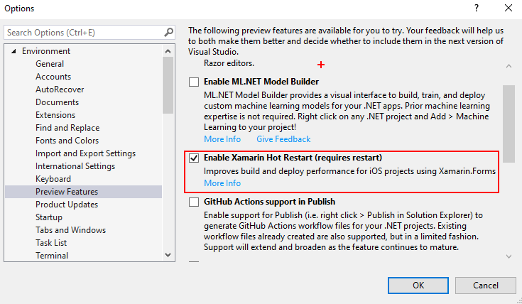

Re-Start VS19 as suggested and then we need to make the iOS project our start-up project so in the Solution explorer right click the iOS project and set as the Start-up project.

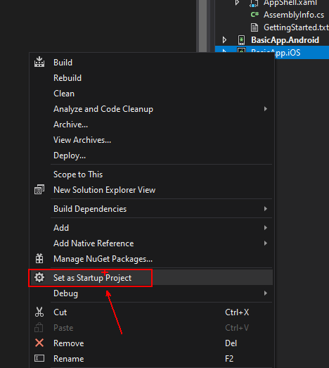

Now that we have the iOS Project as the start-up plug in your iPhone using a standard iPhone USB cable nothing fancy just the regular one you use to charge your phone every night will do and then you will notice that the toolbar debug device will change to Local Device:

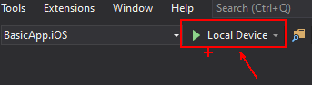

And this is the clever part that the Xamarin team spent clearly a lot of time, clicking this will take you through a Wizard to do the rest of the set-up:

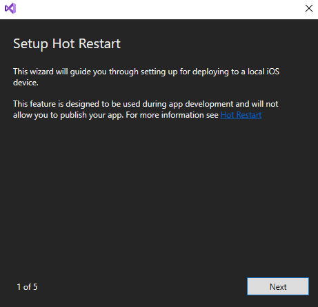

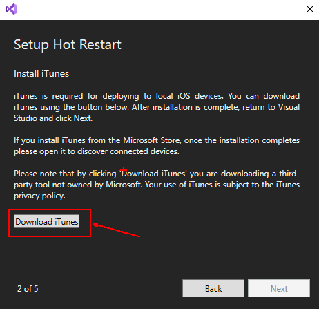

In Step 2 you will be asked to download iTunes and it's this connection to the iPhone that Visual Studio uses to deploy and debug your Application, so click the button and you'll be taken to the iTunes website to download the software, all you need to do is click the "Get it from Microsoft" button and follow the store instructions.

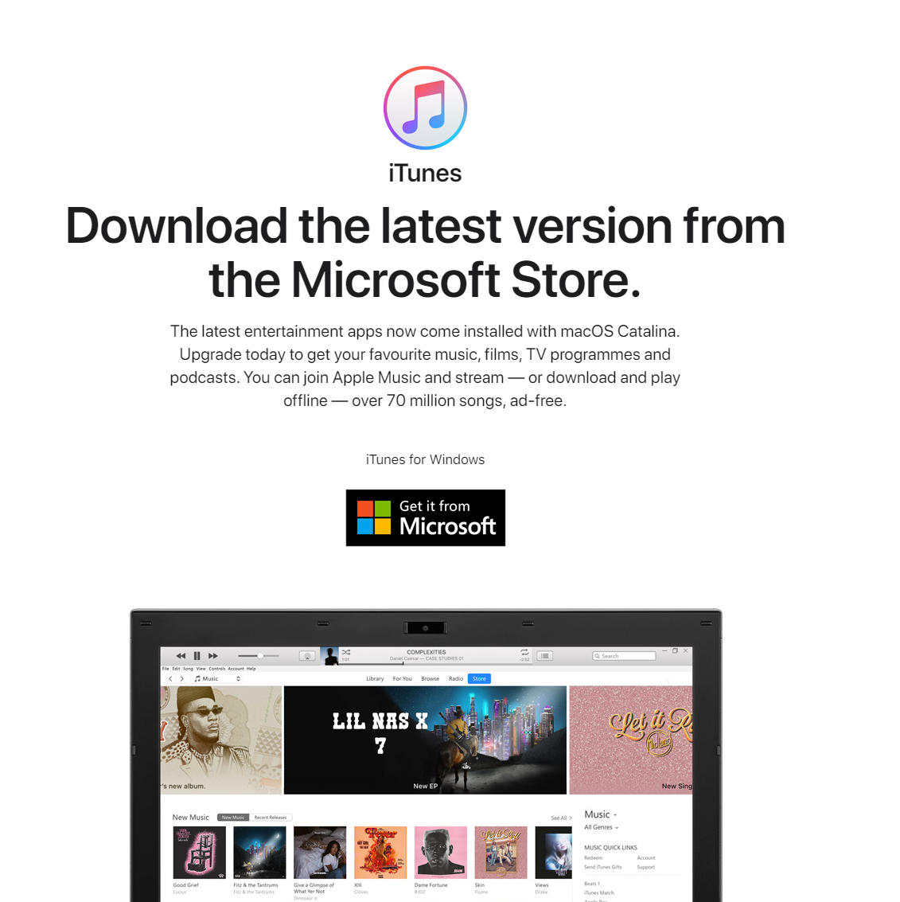

Don't worry the VS19 wizard will quietly sit and wait for you.  Once installed open the iTunes application and click all the Agree to terms and conditions stuff (Obviously you read it all right! 😉)  

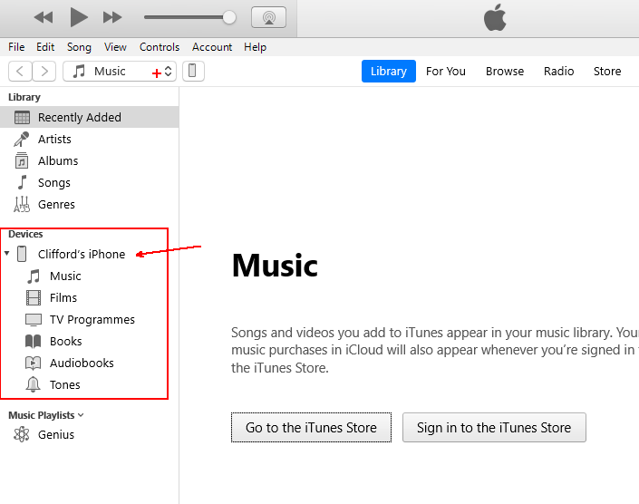

Once this is done you can return the VS19 wizard and it should move onto the next step asking you for your Developer Account credentials.  If it doesn't do this check that iTunes is open and that you can see your device listed on the left, you may need to unplug it and plug back in again for this to happen.

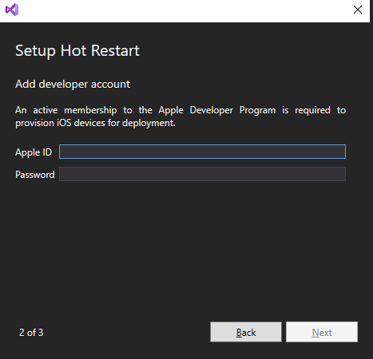

When you enter the account details it will ask for the 2 factor auth code from your device

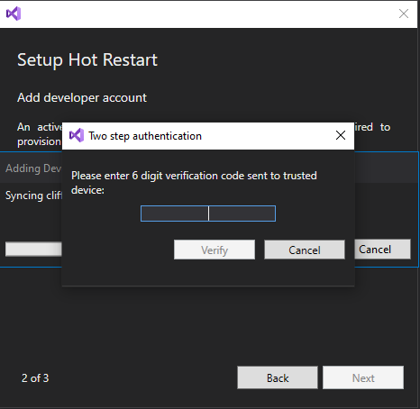

Check your Apple account registered device and it should give you an Apple ID Verification Code to enter here.

Now you will be asked to select a team:

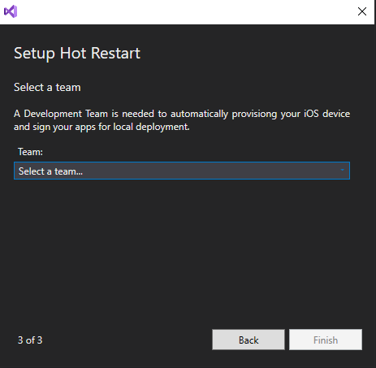

When you do this the wizard will automatically provision the device using your Apple Developer Account you provided and that’s it you’re done, click the Finish button and enjoy.  It will now build the Application and deploy to your device, then you will see a pop-up inside VS19 that will ask you to manually open the App on the device:

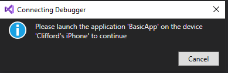

Sadly, as Awesome as Hot Restart is it can't remotely open the App so you still need your finger to poke the screen, but if you think about the awesome tech in use here an Apple iPhone being deployed to and debugging with just your Windows Machine so if you ask me a poke of the screen each deploy isn't much to ask.

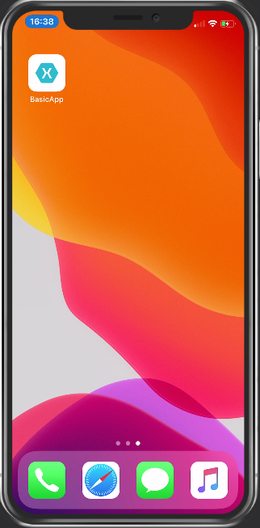

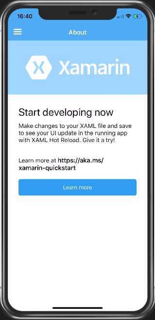

## Fixing that UI

Now that you have the system set-up and working you can fix up that UI so go into your XAML/C# for the UI page you want to edit and well just edit away...  Sadly, it doesn't use Hot Reload to reload your changes like it does for Android but I am sure this is on the TODO list for the Xamarin team. So, when your changes are made click the Restart button or (CTRL+SHIFT+F5) and the changes will be re-built and deployed before your trusty finger can poke the screen again

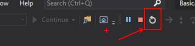

## Screen Mirroring

Now you have this all set-up and working you may be wondering what tool all these speakers use when they mirror the iPhone to their laptop, well me I use the Reflector 3 App from AirSquirrel which you can find here [https://www.airsquirrels.com/reflector](https://www.airsquirrels.com/reflector) it's not very expensive and works flawlessly.

If you want to Mirror your Android (While we are on the subject I guess!) then I use Vysor which is again fairly inexpensive there is even a free version that can be found here: [https://www.vysor.io/](https://www.vysor.io/)

## Conclusion

This for me is an amazing tool and best part is it's free with any version of VS19 even the community version and allows you to build/debug/deploy applications for iOS directly from your Windows machine with NO NEED for a Mac anywhere in your pipeline.

However, to deploy your amazing new App to the App Store you WILL still need a Mac but if like me you are on your travels a lot and away from the Mac or you don't have one then I suggest trying [AppCenter](https://appcenter.ms/) for your builds and I'll talk about setting that up in my next blog post and how you can develop and deploy without a Mac using these amazing free tools from Microsoft.

Happy Coding!

